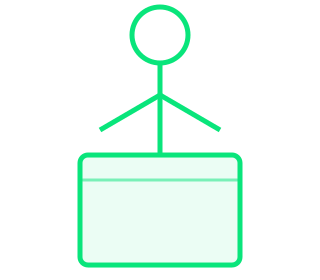
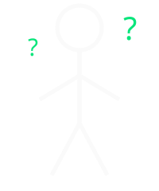

::: {#title-howto .howto}
**Edit me:** set `title`, `subtitle`, and `author` at the top of `index.qmd`. Delete this `.howto` box when you're done.

Note that this slide does not automatically advance... you need to manually advance to the next slide. Subsequent slides will automatically advance.
:::

## {#slide-01 background-image="images/pexels-matthew-montrone-230847-2395812.jpg" background-size="cover" background-position="center"}

::: {.deep-shade}
:::

::: {.center-v .deep-copy}
[Thanks for agreeing to give a lightning talk!]{.statement-sub .a-fade style="--d:0.3s"}

[Your talk]{.statement .a-rise style="--d:2s"}

[is going]{.statement .a-rise style="--d:4s"}

[to be]{.statement .a-rise style="--d:6s"}

[great!!!]{.statement .hl .a-rise style="--d:8.5s"}
:::


## Basics {#slide-02 .hide-title}

::: {.howto .bottom}
**Edit me:** replace this text for this slide (and others) with your own by editing the `index.qmd` file. Delete this `.howto`box when you're done.
:::

This content for all slides can be updated by editing the `index.qmd` file.

It uses the **markdown** markup language, which has a simple syntax for formatting text. The Quarto docs have a good [reference](https://quarto.org/docs/authoring/markdown-syntax.html) for the syntax.

This content on this slide is simple... just text with minor formatting.


## Images {#slide-03}

You can add images to slides by embedding the image file in the slide content.

{width=500 fig-align="center"}

## Images - absolute placement {#slide-04}

You can also place multiple images at precise positions with the `.absolute` class and `top`/`left`/`bottom`/`right` offsets (in pixels, on a 1600 × 900 slide).

{.absolute top=250 left=80 width=380}

{.absolute top=350 left=180 width=380 fig-alt="Line-art mountain range"}

{.absolute bottom=90 right=120 width=360 fig-alt="Line chart trending upward"}


## SVG graphics {#slide-05}

You can add SVG graphics for line art, like the one below, by referencing an SVG file.


## {#slide-06}

::: {.center-v}
{fig-alt="Cloud Native Geospatial Forum logo" width=500}

### Cloud Native Geospatial community
:::

## {#slide-07}

::: {.center-v}
{fig-alt="Stick figure standing at a podium"}

### Your have 5 minutes to share anything
:::


## {#slide-08}

::: {.center-v}
::: {.formula}
[20]{.highlight} slides  ×  [15]{.highlight} seconds  =  **5 minutes**
:::
:::


## {#slide-09}

::: {.center-v}
{fig-alt="A slide with an arrow pointing to a circle containing the number 1"}

### One slide. One idea. 15 seconds.
:::


## {#slide-10}

::: {.center-v}
<!-- Raw <h3>, not ###: a heading first in a div becomes its own nested slide (#/getting-creative) -->
```{=html}
<h3><strong>Getting creative</strong></h3>
```

If you have access to an AI assistant, you can point it at the source code for this presentation and ask it to modify slides.

The following slides show some examples of what you can do...
(Thanks to Alex for sharing these examples!)
:::


## {#slide-11}

::: {.howto}
**Separation of concerns:** this slide is split across three files. `index.qmd` holds the content (the SVG and text below), `custom.scss` holds the look and the timed CSS animations (search for "Slide 11"), and `animations.html` holds the JavaScript that runs the clock.
:::

```{=html}
<svg class="photon-trip" viewBox="0 0 1600 900" aria-label="A photon travels from the Sun to Earth in 8 minutes 20 seconds">
  <defs>
    <radialGradient id="sun-fill" cx="0.5" cy="0.5" r="0.5">
      <stop offset="0" stop-color="#fff3b0"/>
      <stop offset="0.7" stop-color="#FFD626"/>
      <stop offset="1" stop-color="#f0a01f"/>
    </radialGradient>
    <filter id="soft-glow" x="-50%" y="-50%" width="200%" height="200%">
      <feGaussianBlur stdDeviation="6" result="b"/>
      <feMerge><feMergeNode in="b"/><feMergeNode in="SourceGraphic"/></feMerge>
    </filter>
    <filter id="halo" x="-50%" y="-50%" width="200%" height="200%">
      <feGaussianBlur stdDeviation="40"/>
    </filter>
  </defs>

  <!-- Sun -->
  <circle cx="-260" cy="450" r="600" fill="#FFD626" opacity="0.3" filter="url(#halo)"/>
  <circle cx="-260" cy="450" r="560" fill="url(#sun-fill)"/>

  <!-- Earth -->
  <circle class="earth-glow" cx="1340" cy="450" r="110" fill="#2126F7" filter="url(#halo)"/>
  <g stroke="#F2F4F6" stroke-width="4" fill="none">
    <circle cx="1340" cy="450" r="72" fill="rgba(33,38,247,0.25)"/>
    <ellipse cx="1340" cy="450" rx="30" ry="72"/>
    <line x1="1268" y1="450" x2="1412" y2="450"/>
    <path d="M1280 414 Q1340 426 1400 414"/>
    <path d="M1280 486 Q1340 474 1400 486"/>
  </g>

  <!-- Photon -->
  <path class="photon-trail" pathLength="1000" fill="none" stroke="#FFD626" stroke-width="3" stroke-linecap="round"
        d="M303 450 q15 -16 30 0 t30 0 t30 0 t30 0 t30 0 t30 0 t30 0 t30 0 t30 0 t30 0 t30 0 t30 0 t30 0 t30 0 t30 0 t30 0 t30 0 t30 0 t30 0 t30 0 t30 0 t30 0 t30 0 t30 0 t30 0 t30 0 t30 0 t30 0 t30 0 t30 0 t30 0 t30 0"/>
  <path class="photon-head" pathLength="1000" fill="none" stroke="#fff6d8" stroke-width="7" stroke-linecap="round" filter="url(#soft-glow)"
        d="M303 450 q15 -16 30 0 t30 0 t30 0 t30 0 t30 0 t30 0 t30 0 t30 0 t30 0 t30 0 t30 0 t30 0 t30 0 t30 0 t30 0 t30 0 t30 0 t30 0 t30 0 t30 0 t30 0 t30 0 t30 0 t30 0 t30 0 t30 0 t30 0 t30 0 t30 0 t30 0 t30 0 t30 0"/>
</svg>
<p class="trip-clock">0:00</p>
<p class="trip-caption">Sunlight takes 8 min 20 s to cross 93 million miles</p>
```

## {#slide-12}

[Dig deeper: find the dependencies, lean into the taxonomy]{.headline .slide-top}

```{=html}
<div class="dep-layout">
  <svg class="dep-graph" viewBox="0 0 700 360" aria-label="Dependency graph: A depends on B and C, B depends on D">
    <g stroke="#FFD626" stroke-width="4" fill="none">
      <path class="dep-edge" style="--d:0.4s" pathLength="1" d="M584 168 L392.7 78"/>
      <path class="dep-edge" style="--d:1s" pathLength="1" d="M296 60 L126 60"/>
      <path class="dep-edge" style="--d:1.6s" pathLength="1" d="M584 196 L392.8 280.3"/>
    </g>
    <g fill="#FFD626">
      <path class="a-fade" style="--d:0.85s" d="M380 72 L400.1 71.5 L392.5 87.8 Z"/>
      <path class="a-fade" style="--d:1.45s" d="M112 60 L130 51 L130 69 Z"/>
      <path class="a-fade" style="--d:2.05s" d="M380 286 L392.8 270.5 L400.1 287 Z"/>
    </g>
    <g stroke="#FFD626" stroke-width="4" fill="rgba(255,214,38,0.08)">
      <circle cx="70" cy="60" r="42"/>
      <circle cx="338" cy="60" r="42"/>
      <circle cx="624" cy="182" r="42"/>
      <circle cx="338" cy="300" r="42"/>
    </g>
    <g class="dep-labels" text-anchor="middle">
      <text x="70" y="72">D</text>
      <text x="338" y="72">B</text>
      <text x="624" y="194">A</text>
      <text x="338" y="312">C</text>
    </g>
  </svg>
  <ul class="families">
    <li class="a-rise" style="--c:#4a7fd8; --d:2.2s"><b>F1</b> Physical and biological foundations</li>
    <li class="a-rise" style="--c:#e07040; --d:2.6s"><b>F2</b> Knowledge, evidence, and methods</li>
    <li class="a-rise" style="--c:#5bb58a; --d:3.0s"><b>F3</b> People, skills, and work</li>
    <li class="a-rise" style="--c:#e3a83a; --d:3.4s"><b>F4</b> Technology, components, and tools</li>
    <li class="a-rise" style="--c:#e088a8; --d:3.8s"><b>F5</b> Infrastructure and operational services</li>
    <li class="a-rise" style="--c:#4f9a35; --d:4.2s"><b>F6</b> Organizations, institutions, and governance</li>
    <li class="a-rise" style="--c:#7a6ad6; --d:4.6s"><b>F7</b> Resources, production, and economic support</li>
    <li class="a-rise" style="--c:#e0595a; --d:5.0s"><b>F8</b> Relationships, communication, and adoption</li>
  </ul>
</div>
```


## {#slide-13}

```{=html}
<svg class="cartwheels" viewBox="0 0 1600 900" aria-label="Stick figures cartwheeling across the screen in both directions, near and far">
<g stroke-width="6" stroke-linecap="round" stroke-linejoin="round" fill="none">
<!-- Far layer first so nearer figures draw on top -->
  <g class="cw-move" style="--x0:1760px; --x1:-160px; --cw:10.47s; --cd:-9.87s">
    <g transform="translate(0 345) scale(0.45)" stroke="#8B929B">
      <g class="cw-spin" style="--spin:-1956deg">
        <circle cx="0" cy="-97" r="22" fill="#1D232B"/>
        <line x1="0" y1="-75" x2="0" y2="25"/>
        <polyline points="-75,-110 0,-55 75,-110"/>
        <polyline points="-62,110 0,25 62,110"/>
      </g>
    </g>
  </g>
  <g class="cw-move" style="--x0:-160px; --x1:1760px; --cw:10.47s; --cd:-0.30s">
    <g transform="translate(0 351) scale(0.45)" stroke="#8B929B">
      <g class="cw-spin" style="--spin:1956deg">
        <circle cx="0" cy="-97" r="22" fill="#1D232B"/>
        <line x1="0" y1="-75" x2="0" y2="25"/>
        <polyline points="-75,-110 0,-55 75,-110"/>
        <polyline points="-62,110 0,25 62,110"/>
      </g>
    </g>
  </g>
  <g class="cw-move" style="--x0:1760px; --x1:-160px; --cw:11.35s; --cd:-7.36s">
    <g transform="translate(0 352) scale(0.45)" stroke="#8B929B">
      <g class="cw-spin" style="--spin:-1956deg">
        <circle cx="0" cy="-97" r="22" fill="#1D232B"/>
        <line x1="0" y1="-75" x2="0" y2="25"/>
        <polyline points="-75,-110 0,-55 75,-110"/>
        <polyline points="-62,110 0,25 62,110"/>
      </g>
    </g>
  </g>
  <g class="cw-move" style="--x0:-160px; --x1:1760px; --cw:10.02s; --cd:-4.70s">
    <g transform="translate(0 311) scale(0.45)" stroke="#8B929B">
      <g class="cw-spin" style="--spin:1956deg">
        <circle cx="0" cy="-97" r="22" fill="#1D232B"/>
        <line x1="0" y1="-75" x2="0" y2="25"/>
        <polyline points="-75,-110 0,-55 75,-110"/>
        <polyline points="-62,110 0,25 62,110"/>
      </g>
    </g>
  </g>
  <g class="cw-move" style="--x0:-160px; --x1:1760px; --cw:7.12s; --cd:-0.09s">
    <g transform="translate(0 504) scale(0.7)" stroke="#BCC1C8">
      <g class="cw-spin" style="--spin:1257deg">
        <circle cx="0" cy="-97" r="22" fill="#1D232B"/>
        <line x1="0" y1="-75" x2="0" y2="25"/>
        <polyline points="-75,-110 0,-55 75,-110"/>
        <polyline points="-62,110 0,25 62,110"/>
      </g>
    </g>
  </g>
  <g class="cw-move" style="--x0:1760px; --x1:-160px; --cw:7.89s; --cd:-7.23s">
    <g transform="translate(0 489) scale(0.7)" stroke="#BCC1C8">
      <g class="cw-spin" style="--spin:-1257deg">
        <circle cx="0" cy="-97" r="22" fill="#1D232B"/>
        <line x1="0" y1="-75" x2="0" y2="25"/>
        <polyline points="-75,-110 0,-55 75,-110"/>
        <polyline points="-62,110 0,25 62,110"/>
      </g>
    </g>
  </g>
  <g class="cw-move" style="--x0:-160px; --x1:1760px; --cw:6.69s; --cd:-5.33s">
    <g transform="translate(0 483) scale(0.7)" stroke="#BCC1C8">
      <g class="cw-spin" style="--spin:1257deg">
        <circle cx="0" cy="-97" r="22" fill="#1D232B"/>
        <line x1="0" y1="-75" x2="0" y2="25"/>
        <polyline points="-75,-110 0,-55 75,-110"/>
        <polyline points="-62,110 0,25 62,110"/>
      </g>
    </g>
  </g>
  <g class="cw-move" style="--x0:-160px; --x1:1760px; --cw:4.88s; --cd:-0.01s">
    <g transform="translate(0 681) scale(1.0)" stroke="#F2F4F6">
      <g class="cw-spin" style="--spin:880deg">
        <circle cx="0" cy="-97" r="22" fill="#1D232B"/>
        <line x1="0" y1="-75" x2="0" y2="25"/>
        <polyline points="-75,-110 0,-55 75,-110"/>
        <polyline points="-62,110 0,25 62,110"/>
      </g>
    </g>
  </g>
  <g class="cw-move" style="--x0:1760px; --x1:-160px; --cw:4.55s; --cd:-0.98s">
    <g transform="translate(0 685) scale(1.0)" stroke="#F2F4F6">
      <g class="cw-spin" style="--spin:-880deg">
        <circle cx="0" cy="-97" r="22" fill="#1D232B"/>
        <line x1="0" y1="-75" x2="0" y2="25"/>
        <polyline points="-75,-110 0,-55 75,-110"/>
        <polyline points="-62,110 0,25 62,110"/>
      </g>
    </g>
  </g>
  <g class="cw-move" style="--x0:-160px; --x1:1760px; --cw:4.41s; --cd:-1.28s">
    <g transform="translate(0 719) scale(1.0)" stroke="#F2F4F6">
      <g class="cw-spin" style="--spin:880deg">
        <circle cx="0" cy="-97" r="22" fill="#1D232B"/>
        <line x1="0" y1="-75" x2="0" y2="25"/>
        <polyline points="-75,-110 0,-55 75,-110"/>
        <polyline points="-62,110 0,25 62,110"/>
      </g>
    </g>
  </g>
</g>
</svg>
```


## {#slide-14}

::: {.center-v}
{fig-alt="Stick figure pointing up at a glowing lightbulb"}

### Sharing sparks new ideas
:::


## {#slide-15}


::: {.center-v}
{fig-alt="Stick figure surrounded by question marks"}

### **[The problem]** {.muted}

[What's broken or missing?]{.muted}
:::


## {#slide-16}

::: {.center-v}
{fig-alt="Glowing lightbulb"}

### **[The big idea]** {.muted}

[Your core insight in one sentence]{.muted}
:::


## {#slide-17}

::: {.center-v}
{fig-alt="Browser window with placeholder text lines"}

### **[Live demo]** {.muted}

[Screenshot, GIF, or live walkthrough]{.muted}
:::


## {#slide-18}

::: {.center-v}
{fig-alt="Line chart trending upward"}

### **[Results]** {.muted}

[One metric that got measurably better]{.muted}
:::


## {#slide-19}

 Links

[cloudnativegeo.org](https://cloudnativegeo.org)

[This template on GitHub](https://github.com/cloudnativegeo/lightning-talk-quarto-TEMPLATE)


## {#slide-20}

```{=html}
<canvas class="grow-network"></canvas>
<div class="closing-copy">
  <p class="statement a-rise" style="--d:7s">Thanks for sharing.</p>
  <p class="statement-sub hl a-rise" style="--d:9.5s">Wishing you all the best on your presentation.</p>
</div>
```


## {#slide-applause data-autoslide="0" data-state="no-bars"}

```{=html}
<div class="center-v">
<svg class="clappers" viewBox="0 0 1500 520" aria-label="A crowd of stick figures clapping, with the occasional high-five">
  <g stroke-width="6" stroke-linecap="round" stroke-linejoin="round" fill="none">
    <!-- Back row first so nearer figures draw on top; forearms swing about the elbow -->
    <g class="drift" style="--dx:3.1px; --dy:0.1px; --dp:3.48s; --dd:-2.38s">
    <svg class="clapper" x="75" y="-6" width="140" height="210" viewBox="0 0 200 300" style="--d:0.27s; --t:0.27s" stroke="#8B929B">
      <line x1="100" y1="88" x2="100" y2="190"/>
      <polyline points="65,270 100,190 135,270"/>
      <g class="side side-l"><line x1="100" y1="105" x2="50" y2="160"/><line class="forearm forearm-l" style="transform-origin:50px 160px" x1="50" y1="160" x2="96" y2="140"/></g>
      <g class="side side-r"><line x1="100" y1="105" x2="150" y2="160"/><line class="forearm forearm-r" style="transform-origin:150px 160px" x1="150" y1="160" x2="104" y2="140"/></g>
      <circle cx="100" cy="60" r="28" fill="#1D232B"/>
      <g class="spark" stroke="#FFD626" stroke-width="4">
        <line x1="90" y1="132" x2="81" y2="132"/><line x1="110" y1="132" x2="119" y2="132"/>
      </g>
    </svg>
    </g>
    <g class="drift" style="--dx:2.0px; --dy:1.0px; --dp:3.08s; --dd:-2.33s">
    <svg class="clapper" x="267" y="1" width="140" height="210" viewBox="0 0 200 300" style="--d:0.55s; --t:0.26s" stroke="#8B929B">
      <line x1="100" y1="88" x2="100" y2="190"/>
      <polyline points="65,270 100,190 135,270"/>
      <g class="side side-l"><line x1="100" y1="105" x2="50" y2="160"/><line class="forearm forearm-l" style="transform-origin:50px 160px" x1="50" y1="160" x2="96" y2="140"/></g>
      <g class="side side-r"><line x1="100" y1="105" x2="150" y2="160"/><line class="forearm forearm-r" style="transform-origin:150px 160px" x1="150" y1="160" x2="104" y2="140"/></g>
      <circle cx="100" cy="60" r="28" fill="#1D232B"/>
      <g class="spark" stroke="#FFD626" stroke-width="4">
        <line x1="90" y1="132" x2="81" y2="132"/><line x1="110" y1="132" x2="119" y2="132"/>
      </g>
    </svg>
    </g>
    <g class="drift" style="--dx:2.9px; --dy:1.6px; --dp:4.16s; --dd:-0.57s">
    <g class="walker" style="--hf:4.37s; --hfd:1.55s; --w:56px">
    <svg class="clapper" x="467" y="0" width="140" height="210" viewBox="0 0 200 300" style="--d:0.30s; --t:0.27s" stroke="#8B929B">
      <line x1="100" y1="88" x2="100" y2="190"/>
      <polyline points="65,270 100,190 135,270"/>
      <g class="side side-l"><line x1="100" y1="105" x2="50" y2="160"/><line class="forearm forearm-l" style="transform-origin:50px 160px" x1="50" y1="160" x2="96" y2="140"/></g>
      <g class="side side-r hf-hide"><line x1="100" y1="105" x2="150" y2="160"/><line class="forearm forearm-r" style="transform-origin:150px 160px" x1="150" y1="160" x2="104" y2="140"/></g>
      <line class="hf-arm hf-arm-r" style="transform-origin:100px 105px" x1="100" y1="105" x2="190" y2="105"/>
      <circle cx="100" cy="60" r="28" fill="#1D232B"/>
      <g class="spark" stroke="#FFD626" stroke-width="4">
        <line x1="90" y1="132" x2="81" y2="132"/><line x1="110" y1="132" x2="119" y2="132"/>
      </g>
    </svg>
    </g>
    </g>
    <g class="drift" style="--dx:2.9px; --dy:1.6px; --dp:4.16s; --dd:-0.57s">
    <g class="walker" style="--hf:4.37s; --hfd:1.55s; --w:-56px">
    <svg class="clapper" x="678" y="-7" width="140" height="210" viewBox="0 0 200 300" style="--d:0.11s; --t:0.26s" stroke="#8B929B">
      <line x1="100" y1="88" x2="100" y2="190"/>
      <polyline points="65,270 100,190 135,270"/>
      <g class="side side-l hf-hide"><line x1="100" y1="105" x2="50" y2="160"/><line class="forearm forearm-l" style="transform-origin:50px 160px" x1="50" y1="160" x2="96" y2="140"/></g>
      <g class="side side-r"><line x1="100" y1="105" x2="150" y2="160"/><line class="forearm forearm-r" style="transform-origin:150px 160px" x1="150" y1="160" x2="104" y2="140"/></g>
      <line class="hf-arm hf-arm-l" style="transform-origin:100px 105px" x1="100" y1="105" x2="10" y2="105"/>
      <circle cx="100" cy="60" r="28" fill="#1D232B"/>
      <g class="spark" stroke="#FFD626" stroke-width="4">
        <line x1="90" y1="132" x2="81" y2="132"/><line x1="110" y1="132" x2="119" y2="132"/>
      </g>
    </svg>
    </g>
    </g>
    <g class="drift" style="--dx:2.4px; --dy:0.6px; --dp:4.85s; --dd:-1.95s">
    <svg class="clapper" x="878" y="5" width="140" height="210" viewBox="0 0 200 300" style="--d:0.38s; --t:0.30s" stroke="#8B929B">
      <line x1="100" y1="88" x2="100" y2="190"/>
      <polyline points="65,270 100,190 135,270"/>
      <g class="side side-l"><line x1="100" y1="105" x2="50" y2="160"/><line class="forearm forearm-l" style="transform-origin:50px 160px" x1="50" y1="160" x2="96" y2="140"/></g>
      <g class="side side-r"><line x1="100" y1="105" x2="150" y2="160"/><line class="forearm forearm-r" style="transform-origin:150px 160px" x1="150" y1="160" x2="104" y2="140"/></g>
      <circle cx="100" cy="60" r="28" fill="#1D232B"/>
      <g class="spark" stroke="#FFD626" stroke-width="4">
        <line x1="90" y1="132" x2="81" y2="132"/><line x1="110" y1="132" x2="119" y2="132"/>
      </g>
    </svg>
    </g>
    <g class="drift" style="--dx:1.2px; --dy:1.4px; --dp:3.41s; --dd:-3.26s">
    <svg class="clapper" x="1072" y="2" width="140" height="210" viewBox="0 0 200 300" style="--d:0.06s; --t:0.24s" stroke="#8B929B">
      <line x1="100" y1="88" x2="100" y2="190"/>
      <polyline points="65,270 100,190 135,270"/>
      <g class="side side-l"><line x1="100" y1="105" x2="50" y2="160"/><line class="forearm forearm-l" style="transform-origin:50px 160px" x1="50" y1="160" x2="96" y2="140"/></g>
      <g class="side side-r"><line x1="100" y1="105" x2="150" y2="160"/><line class="forearm forearm-r" style="transform-origin:150px 160px" x1="150" y1="160" x2="104" y2="140"/></g>
      <circle cx="100" cy="60" r="28" fill="#1D232B"/>
      <g class="spark" stroke="#FFD626" stroke-width="4">
        <line x1="90" y1="132" x2="81" y2="132"/><line x1="110" y1="132" x2="119" y2="132"/>
      </g>
    </svg>
    </g>
    <g class="drift" style="--dx:0.8px; --dy:1.3px; --dp:3.96s; --dd:-2.17s">
    <svg class="clapper" x="1282" y="-2" width="140" height="210" viewBox="0 0 200 300" style="--d:0.05s; --t:0.30s" stroke="#8B929B">
      <line x1="100" y1="88" x2="100" y2="190"/>
      <polyline points="65,270 100,190 135,270"/>
      <g class="side side-l"><line x1="100" y1="105" x2="50" y2="160"/><line class="forearm forearm-l" style="transform-origin:50px 160px" x1="50" y1="160" x2="96" y2="140"/></g>
      <g class="side side-r"><line x1="100" y1="105" x2="150" y2="160"/><line class="forearm forearm-r" style="transform-origin:150px 160px" x1="150" y1="160" x2="104" y2="140"/></g>
      <circle cx="100" cy="60" r="28" fill="#1D232B"/>
      <g class="spark" stroke="#FFD626" stroke-width="4">
        <line x1="90" y1="132" x2="81" y2="132"/><line x1="110" y1="132" x2="119" y2="132"/>
      </g>
    </svg>
    </g>
    <g class="drift" style="--dx:6.0px; --dy:-0.7px; --dp:3.39s; --dd:-0.69s">
    <svg class="clapper" x="114" y="101" width="170" height="255" viewBox="0 0 200 300" style="--d:0.42s; --t:0.21s" stroke="#BCC1C8">
      <line x1="100" y1="88" x2="100" y2="190"/>
      <polyline points="65,270 100,190 135,270"/>
      <g class="side side-l"><line x1="100" y1="105" x2="50" y2="160"/><line class="forearm forearm-l" style="transform-origin:50px 160px" x1="50" y1="160" x2="96" y2="140"/></g>
      <g class="side side-r"><line x1="100" y1="105" x2="150" y2="160"/><line class="forearm forearm-r" style="transform-origin:150px 160px" x1="150" y1="160" x2="104" y2="140"/></g>
      <circle cx="100" cy="60" r="28" fill="#1D232B"/>
      <g class="spark" stroke="#FFD626" stroke-width="4">
        <line x1="90" y1="132" x2="81" y2="132"/><line x1="110" y1="132" x2="119" y2="132"/>
      </g>
    </svg>
    </g>
    <g class="drift" style="--dx:3.5px; --dy:-2.3px; --dp:2.58s; --dd:-1.89s">
    <g class="walker" style="--hf:1.55s; --hfd:1.98s; --w:58px">
    <svg class="clapper" x="332" y="89" width="170" height="255" viewBox="0 0 200 300" style="--d:0.59s; --t:0.32s" stroke="#BCC1C8">
      <line x1="100" y1="88" x2="100" y2="190"/>
      <polyline points="65,270 100,190 135,270"/>
      <g class="side side-l"><line x1="100" y1="105" x2="50" y2="160"/><line class="forearm forearm-l" style="transform-origin:50px 160px" x1="50" y1="160" x2="96" y2="140"/></g>
      <g class="side side-r hf-hide"><line x1="100" y1="105" x2="150" y2="160"/><line class="forearm forearm-r" style="transform-origin:150px 160px" x1="150" y1="160" x2="104" y2="140"/></g>
      <line class="hf-arm hf-arm-r" style="transform-origin:100px 105px" x1="100" y1="105" x2="190" y2="105"/>
      <circle cx="100" cy="60" r="28" fill="#1D232B"/>
      <g class="spark" stroke="#FFD626" stroke-width="4">
        <line x1="90" y1="132" x2="81" y2="132"/><line x1="110" y1="132" x2="119" y2="132"/>
      </g>
    </svg>
    </g>
    </g>
    <g class="drift" style="--dx:3.5px; --dy:-2.3px; --dp:2.58s; --dd:-1.89s">
    <g class="walker" style="--hf:1.55s; --hfd:1.98s; --w:-58px">
    <svg class="clapper" x="567" y="90" width="170" height="255" viewBox="0 0 200 300" style="--d:0.39s; --t:0.27s" stroke="#BCC1C8">
      <line x1="100" y1="88" x2="100" y2="190"/>
      <polyline points="65,270 100,190 135,270"/>
      <g class="side side-l hf-hide"><line x1="100" y1="105" x2="50" y2="160"/><line class="forearm forearm-l" style="transform-origin:50px 160px" x1="50" y1="160" x2="96" y2="140"/></g>
      <g class="side side-r"><line x1="100" y1="105" x2="150" y2="160"/><line class="forearm forearm-r" style="transform-origin:150px 160px" x1="150" y1="160" x2="104" y2="140"/></g>
      <line class="hf-arm hf-arm-l" style="transform-origin:100px 105px" x1="100" y1="105" x2="10" y2="105"/>
      <circle cx="100" cy="60" r="28" fill="#1D232B"/>
      <g class="spark" stroke="#FFD626" stroke-width="4">
        <line x1="90" y1="132" x2="81" y2="132"/><line x1="110" y1="132" x2="119" y2="132"/>
      </g>
    </svg>
    </g>
    </g>
    <g class="drift" style="--dx:-0.5px; --dy:-1.6px; --dp:4.10s; --dd:-0.90s">
    <g class="walker" style="--hf:8.62s; --hfd:1.56s; --w:39px">
    <svg class="clapper" x="777" y="93" width="170" height="255" viewBox="0 0 200 300" style="--d:0.09s; --t:0.20s" stroke="#BCC1C8">
      <line x1="100" y1="88" x2="100" y2="190"/>
      <polyline points="65,270 100,190 135,270"/>
      <g class="side side-l"><line x1="100" y1="105" x2="50" y2="160"/><line class="forearm forearm-l" style="transform-origin:50px 160px" x1="50" y1="160" x2="96" y2="140"/></g>
      <g class="side side-r hf-hide"><line x1="100" y1="105" x2="150" y2="160"/><line class="forearm forearm-r" style="transform-origin:150px 160px" x1="150" y1="160" x2="104" y2="140"/></g>
      <line class="hf-arm hf-arm-r" style="transform-origin:100px 105px" x1="100" y1="105" x2="190" y2="105"/>
      <circle cx="100" cy="60" r="28" fill="#1D232B"/>
      <g class="spark" stroke="#FFD626" stroke-width="4">
        <line x1="90" y1="132" x2="81" y2="132"/><line x1="110" y1="132" x2="119" y2="132"/>
      </g>
    </svg>
    </g>
    </g>
    <g class="drift" style="--dx:-0.5px; --dy:-1.6px; --dp:4.10s; --dd:-0.90s">
    <g class="walker" style="--hf:8.62s; --hfd:1.56s; --w:-39px">
    <svg class="clapper" x="974" y="88" width="170" height="255" viewBox="0 0 200 300" style="--d:0.32s; --t:0.21s" stroke="#BCC1C8">
      <line x1="100" y1="88" x2="100" y2="190"/>
      <polyline points="65,270 100,190 135,270"/>
      <g class="side side-l hf-hide"><line x1="100" y1="105" x2="50" y2="160"/><line class="forearm forearm-l" style="transform-origin:50px 160px" x1="50" y1="160" x2="96" y2="140"/></g>
      <g class="side side-r"><line x1="100" y1="105" x2="150" y2="160"/><line class="forearm forearm-r" style="transform-origin:150px 160px" x1="150" y1="160" x2="104" y2="140"/></g>
      <line class="hf-arm hf-arm-l" style="transform-origin:100px 105px" x1="100" y1="105" x2="10" y2="105"/>
      <circle cx="100" cy="60" r="28" fill="#1D232B"/>
      <g class="spark" stroke="#FFD626" stroke-width="4">
        <line x1="90" y1="132" x2="81" y2="132"/><line x1="110" y1="132" x2="119" y2="132"/>
      </g>
    </svg>
    </g>
    </g>
    <g class="drift" style="--dx:-3.8px; --dy:-2.0px; --dp:4.90s; --dd:-4.79s">
    <svg class="clapper" x="1208" y="94" width="170" height="255" viewBox="0 0 200 300" style="--d:0.11s; --t:0.23s" stroke="#BCC1C8">
      <line x1="100" y1="88" x2="100" y2="190"/>
      <polyline points="65,270 100,190 135,270"/>
      <g class="side side-l"><line x1="100" y1="105" x2="50" y2="160"/><line class="forearm forearm-l" style="transform-origin:50px 160px" x1="50" y1="160" x2="96" y2="140"/></g>
      <g class="side side-r"><line x1="100" y1="105" x2="150" y2="160"/><line class="forearm forearm-r" style="transform-origin:150px 160px" x1="150" y1="160" x2="104" y2="140"/></g>
      <circle cx="100" cy="60" r="28" fill="#1D232B"/>
      <g class="spark" stroke="#FFD626" stroke-width="4">
        <line x1="90" y1="132" x2="81" y2="132"/><line x1="110" y1="132" x2="119" y2="132"/>
      </g>
    </svg>
    </g>
    <g class="drift" style="--dx:7.2px; --dy:-0.1px; --dp:3.27s; --dd:-0.58s">
    <g class="walker" style="--hf:7.54s; --hfd:1.83s; --w:58px">
    <svg class="clapper" x="153" y="199" width="200" height="300" viewBox="0 0 200 300" style="--d:0.02s; --t:0.26s" stroke="#F2F4F6">
      <line x1="100" y1="88" x2="100" y2="190"/>
      <polyline points="65,270 100,190 135,270"/>
      <g class="side side-l"><line x1="100" y1="105" x2="50" y2="160"/><line class="forearm forearm-l" style="transform-origin:50px 160px" x1="50" y1="160" x2="96" y2="140"/></g>
      <g class="side side-r hf-hide"><line x1="100" y1="105" x2="150" y2="160"/><line class="forearm forearm-r" style="transform-origin:150px 160px" x1="150" y1="160" x2="104" y2="140"/></g>
      <line class="hf-arm hf-arm-r" style="transform-origin:100px 105px" x1="100" y1="105" x2="190" y2="105"/>
      <circle cx="100" cy="60" r="28" fill="#1D232B"/>
      <g class="spark" stroke="#FFD626" stroke-width="4">
        <line x1="90" y1="132" x2="81" y2="132"/><line x1="110" y1="132" x2="119" y2="132"/>
      </g>
    </svg>
    </g>
    </g>
    <g class="drift" style="--dx:7.2px; --dy:-0.1px; --dp:3.27s; --dd:-0.58s">
    <g class="walker" style="--hf:7.54s; --hfd:1.83s; --w:-58px">
    <svg class="clapper" x="409" y="203" width="200" height="300" viewBox="0 0 200 300" style="--d:0.26s; --t:0.30s" stroke="#F2F4F6">
      <line x1="100" y1="88" x2="100" y2="190"/>
      <polyline points="65,270 100,190 135,270"/>
      <g class="side side-l hf-hide"><line x1="100" y1="105" x2="50" y2="160"/><line class="forearm forearm-l" style="transform-origin:50px 160px" x1="50" y1="160" x2="96" y2="140"/></g>
      <g class="side side-r"><line x1="100" y1="105" x2="150" y2="160"/><line class="forearm forearm-r" style="transform-origin:150px 160px" x1="150" y1="160" x2="104" y2="140"/></g>
      <line class="hf-arm hf-arm-l" style="transform-origin:100px 105px" x1="100" y1="105" x2="10" y2="105"/>
      <circle cx="100" cy="60" r="28" fill="#1D232B"/>
      <g class="spark" stroke="#FFD626" stroke-width="4">
        <line x1="90" y1="132" x2="81" y2="132"/><line x1="110" y1="132" x2="119" y2="132"/>
      </g>
    </svg>
    </g>
    </g>
    <g class="drift" style="--dx:2.7px; --dy:2.9px; --dp:4.00s; --dd:-2.78s">
    <svg class="clapper" x="652" y="200" width="200" height="300" viewBox="0 0 200 300" style="--d:0.31s; --t:0.28s" stroke="#F2F4F6">
      <line x1="100" y1="88" x2="100" y2="190"/>
      <polyline points="65,270 100,190 135,270"/>
      <g class="side side-l"><line x1="100" y1="105" x2="50" y2="160"/><line class="forearm forearm-l" style="transform-origin:50px 160px" x1="50" y1="160" x2="96" y2="140"/></g>
      <g class="side side-r"><line x1="100" y1="105" x2="150" y2="160"/><line class="forearm forearm-r" style="transform-origin:150px 160px" x1="150" y1="160" x2="104" y2="140"/></g>
      <circle cx="100" cy="60" r="28" fill="#1D232B"/>
      <g class="spark" stroke="#FFD626" stroke-width="4">
        <line x1="90" y1="132" x2="81" y2="132"/><line x1="110" y1="132" x2="119" y2="132"/>
      </g>
    </svg>
    </g>
    <g class="drift" style="--dx:4.6px; --dy:1.3px; --dp:4.78s; --dd:-3.10s">
    <svg class="clapper" x="907" y="197" width="200" height="300" viewBox="0 0 200 300" style="--d:0.30s; --t:0.28s" stroke="#F2F4F6">
      <line x1="100" y1="88" x2="100" y2="190"/>
      <polyline points="65,270 100,190 135,270"/>
      <g class="side side-l"><line x1="100" y1="105" x2="50" y2="160"/><line class="forearm forearm-l" style="transform-origin:50px 160px" x1="50" y1="160" x2="96" y2="140"/></g>
      <g class="side side-r"><line x1="100" y1="105" x2="150" y2="160"/><line class="forearm forearm-r" style="transform-origin:150px 160px" x1="150" y1="160" x2="104" y2="140"/></g>
      <circle cx="100" cy="60" r="28" fill="#1D232B"/>
      <g class="spark" stroke="#FFD626" stroke-width="4">
        <line x1="90" y1="132" x2="81" y2="132"/><line x1="110" y1="132" x2="119" y2="132"/>
      </g>
    </svg>
    </g>
    <g class="drift" style="--dx:4.8px; --dy:-0.1px; --dp:3.64s; --dd:-2.91s">
    <svg class="clapper" x="1139" y="199" width="200" height="300" viewBox="0 0 200 300" style="--d:0.27s; --t:0.23s" stroke="#F2F4F6">
      <line x1="100" y1="88" x2="100" y2="190"/>
      <polyline points="65,270 100,190 135,270"/>
      <g class="side side-l"><line x1="100" y1="105" x2="50" y2="160"/><line class="forearm forearm-l" style="transform-origin:50px 160px" x1="50" y1="160" x2="96" y2="140"/></g>
      <g class="side side-r"><line x1="100" y1="105" x2="150" y2="160"/><line class="forearm forearm-r" style="transform-origin:150px 160px" x1="150" y1="160" x2="104" y2="140"/></g>
      <circle cx="100" cy="60" r="28" fill="#1D232B"/>
      <g class="spark" stroke="#FFD626" stroke-width="4">
        <line x1="90" y1="132" x2="81" y2="132"/><line x1="110" y1="132" x2="119" y2="132"/>
      </g>
    </svg>
    </g>
    <g class="hf-spark" style="--hf:1.55s; --hfd:1.98s" transform="translate(534 129)" stroke="#FFD626" stroke-width="4"><line x1="-7.4" y1="-4.2" x2="-17.7" y2="-10.2"/><line x1="-3.6" y1="-7.7" x2="-8.6" y2="-18.5"/><line x1="0.0" y1="-8.5" x2="0.0" y2="-20.4"/><line x1="3.6" y1="-7.7" x2="8.6" y2="-18.5"/><line x1="7.4" y1="-4.2" x2="17.7" y2="-10.2"/></g>
    <g class="hf-spark" style="--hf:4.37s; --hfd:1.55s" transform="translate(642 30)" stroke="#FFD626" stroke-width="4"><line x1="-6.1" y1="-3.5" x2="-14.5" y2="-8.4"/><line x1="-3.0" y1="-6.3" x2="-7.1" y2="-15.2"/><line x1="0.0" y1="-7.0" x2="0.0" y2="-16.8"/><line x1="3.0" y1="-6.3" x2="7.1" y2="-15.2"/><line x1="6.1" y1="-3.5" x2="14.5" y2="-8.4"/></g>
    <g class="hf-spark" style="--hf:7.54s; --hfd:1.83s" transform="translate(381 248)" stroke="#FFD626" stroke-width="4"><line x1="-8.7" y1="-5.0" x2="-20.8" y2="-12.0"/><line x1="-4.2" y1="-9.1" x2="-10.1" y2="-21.8"/><line x1="0.0" y1="-10.0" x2="0.0" y2="-24.0"/><line x1="4.2" y1="-9.1" x2="10.1" y2="-21.8"/><line x1="8.7" y1="-5.0" x2="20.8" y2="-12.0"/></g>
    <g class="hf-spark" style="--hf:8.62s; --hfd:1.56s" transform="translate(961 131)" stroke="#FFD626" stroke-width="4"><line x1="-7.4" y1="-4.2" x2="-17.7" y2="-10.2"/><line x1="-3.6" y1="-7.7" x2="-8.6" y2="-18.5"/><line x1="0.0" y1="-8.5" x2="0.0" y2="-20.4"/><line x1="3.6" y1="-7.7" x2="8.6" y2="-18.5"/><line x1="7.4" y1="-4.2" x2="17.7" y2="-10.2"/></g>
  </g>
</svg>
<p class="applause-label">(applause time!)</p>
</div>
```

```{=html}
<script>
// Move the title slide's howto box (authored above the first ##) onto the title slide.
// Runs immediately, before RevealJS initializes, so the empty slide it leaves never counts.
(function () {
  var th = document.getElementById('title-howto');
  var ts = document.getElementById('title-slide');
  if (!th || !ts) return;
  var emptySlide = th.closest('section');
  ts.appendChild(th);
  emptySlide.remove();
})();

document.addEventListener('DOMContentLoaded', function () {
  // Give the title slide a clean URL hash (#/slide-title instead of #/title-slide)
  var ts = document.getElementById('title-slide');
  if (ts) ts.id = 'slide-title';

  // Countdown bar: sits above the RevealJS progress bar, runs right-to-left per slide.
  // Only shown while auto-advance is on (e.g. not with ?autoSlide=0), so it never
  // counts down to a slide change that won't happen.
  function resetCountdown() {
    var fill = document.getElementById('slide-countdown-fill');
    fill.style.animation = 'none';
    fill.offsetHeight; // force reflow
    fill.style.animation = '';
  }

  function startCountdown() {
    if (!Reveal.getConfig().autoSlide) return;
    var cdBar = document.createElement('div');
    cdBar.id = 'slide-countdown';
    cdBar.innerHTML = '<div id="slide-countdown-fill"></div>';
    document.querySelector('.reveal').appendChild(cdBar);
    resetCountdown();
    Reveal.on('slidechanged', resetCountdown);
  }

  // Reveal may already be ready by now; if so its 'ready' event has been missed
  if (Reveal.isReady()) startCountdown();
  else Reveal.on('ready', startCountdown);
});
</script>
```
